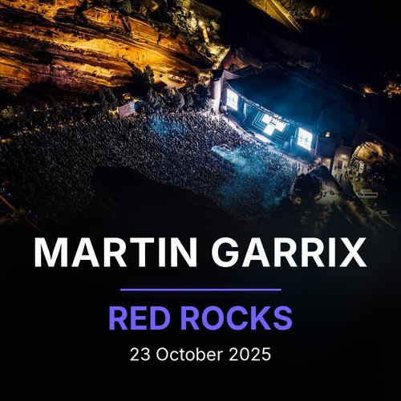
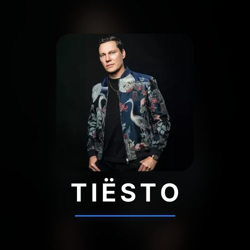
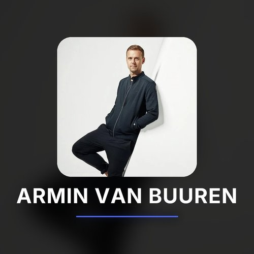

<p align="center">
  
  
  
</p>

<p align="center"><em>Turn chaptered videos into gapless, tagged albums. Lossless FLAC or Opus, fully tagged with cover art, ready for Jellyfin, Lyrion, Navidrome, and Plex.</em></p>

## What is TrackSplit?

TrackSplit is a Python CLI that reads chapter markers from video files (MKV, MP4, WebM, and more), splits the audio into individual tracks at sample-accurate boundaries, and writes a fully tagged music album with embedded cover art and an artist folder picture. FLAC sources stay lossless; Opus and other lossy sources are stream-copied when possible. Re-runs are skipped automatically unless the audio, chapters, or embedded tags actually changed.

> **Pair it with [CrateDigger](https://rouzax.github.io/CrateDigger/):** a sibling CLI that matches festival sets and concert recordings against 1001Tracklists, embeds chapter markers and canonical metadata into MKV files, generates artwork and posters, and syncs your video library into Kodi. TrackSplit reads the chapters and metadata CrateDigger writes, so canonical artist names, festival spellings, and MusicBrainz IDs stay consistent across your video and music libraries. TrackSplit also works on any chaptered video without CrateDigger.
> [Landing page](https://rouzax.github.io/CrateDigger/) · [Documentation](https://rouzax.github.io/CrateDigger/docs/) · [GitHub](https://github.com/Rouzax/CrateDigger)

**Documentation:** [rouzax.github.io/TrackSplit/docs/](https://rouzax.github.io/TrackSplit/docs/) · [Landing page](https://rouzax.github.io/TrackSplit/)

## Cover Gallery

**Album covers** generated for each set (embedded in every track and saved as `cover.jpg` / `folder.jpg`):

<table>
  <tr>
    <td></td>
    <td></td>
    <td></td>
    <td></td>
    <td></td>
  </tr>
</table>

**Artist folder images** (`artist.jpg`) composed from DJ artwork and name:

<table>
  <tr>
    <td></td>
    <td></td>
    <td></td>
    <td></td>
    <td></td>
  </tr>
</table>

## Features

### Split

Sample-accurate cuts at chapter boundaries produce gapless playback across tracks. Works with any video container that carries chapter markers: MKV, MP4, WebM, and more.

### Encode

FLAC sources stay lossless. Opus sources are stream-copied when safe; a transparent re-encode is applied when not. Use `--format` to select `auto`, `flac`, or `opus`.

### Tag

Writes a full set of Vorbis comments to every track:

`TITLE`, `ARTIST`, `ARTISTS`, `ALBUMARTIST`, `ALBUMARTISTS`, `ALBUM`, `TRACKNUMBER`, `TRACKTOTAL`, `DISCNUMBER`, `DATE`, `GENRE`, `PUBLISHER`, `COMMENT`, `MUSICBRAINZ_ARTISTID`, `MUSICBRAINZ_ALBUMARTISTID`, `FESTIVAL`, `STAGE`, `VENUE`.

Multi-artist handling follows the Picard standard: `ARTISTS` lists every collaborator and remixer, and per-artist `MUSICBRAINZ_ARTISTID` values are aligned to that list so Lyrion and Jellyfin can link every contributor, not just the headliner.

Two metadata tiers: basic tagging works for any chaptered video; full enrichment (festival, stage, venue, MusicBrainz IDs) is available when CrateDigger-style tags are present.

### Artwork

Generates a 1:1 album cover, embeds it in every track, and writes it as both `cover.jpg` and `folder.jpg` in the album folder. An artist folder image (`artist.jpg`) is composed from DJ artwork and the artist name.

### Batch and re-run

Process a directory of videos in parallel with multiple workers and a live progress display. A per-album manifest records a fingerprint of the audio stream and the embedded tag set; repeat runs are near-instant unless the audio or tags actually changed.

### Update notifications

Interactive runs check GitHub for newer stable releases and show a one-line upgrade hint. See [Update Notifications](#update-notifications) below.

## Quick Start

New to TrackSplit? The [Getting Started guide](https://rouzax.github.io/TrackSplit/docs/getting-started/) walks through your first split from install to tagged album.

### Prerequisites

- [Python 3.11+](https://www.python.org/downloads/)
- [FFmpeg](https://ffmpeg.org/download.html) (ships `ffmpeg` and `ffprobe`)
- [MKVToolNix](https://mkvtoolnix.download/downloads.html) (optional, provides `mkvextract` and `mkvmerge` for cover extraction from MKV attachments; TrackSplit falls back to FFmpeg if not installed)

### Install

Choose the path that fits how you use TrackSplit:

**pipx (recommended for end users):** installs TrackSplit into its own isolated environment and puts the `tracksplit` command on your PATH without affecting other Python projects.

```bash
pipx install git+https://github.com/Rouzax/TrackSplit.git
```

Upgrade later with:

```bash
pipx upgrade tracksplit
```

**pip (user site or venv):** use this if you prefer pip or are installing into an active virtual environment.

```bash
pip install git+https://github.com/Rouzax/TrackSplit.git
```

Upgrade later with:

```bash
pip install --upgrade git+https://github.com/Rouzax/TrackSplit.git
```

**From source (contributors):** clone the repository, then install in editable mode:

```bash
pip install -e .
```

After installing, verify your setup:

```bash
tracksplit --check
```

`tracksplit --check` probes `ffmpeg`, `ffprobe`, and `mkvextract` and prints their versions (or an install hint if something is missing).

### Usage

```bash
# Single video
tracksplit video.mkv

# Directory of videos
tracksplit /path/to/videos/

# Specify output directory
tracksplit video.mkv --output /path/to/music/library/

# Force regeneration
tracksplit video.mkv --force

# Choose output format (auto, flac, or opus)
tracksplit video.mkv --format opus

# Dry run
tracksplit video.mkv --dry-run --verbose
```

See the [usage guide](https://rouzax.github.io/TrackSplit/docs/usage/) for every flag, what a skipped file means, and what Ctrl+C does mid-run.

## Configuration

TrackSplit works out of the box if `ffmpeg`, `ffprobe`, and (optionally) the MKVToolNix tools are on your `PATH`. If they are installed elsewhere, point TrackSplit at them via a TOML config. Copy [`tracksplit.toml.example`](tracksplit.toml.example) to `config.toml` at the location for your platform and uncomment the keys you need.

Place your config file at the location for your platform:

| Platform | Config file location |
|---|---|
| Linux | `~/TrackSplit/config.toml` |
| macOS | `~/TrackSplit/config.toml` |
| Windows | `Documents\TrackSplit\config.toml` |

```toml
[tools]
ffmpeg     = "/usr/local/bin/ffmpeg"
ffprobe    = "/usr/local/bin/ffprobe"
mkvextract = "/usr/bin/mkvextract"
mkvmerge   = "/usr/bin/mkvmerge"
```

See the [configuration reference](https://rouzax.github.io/TrackSplit/docs/configuration/) for every available key, or the [troubleshooting guide](https://rouzax.github.io/TrackSplit/docs/troubleshooting/) if something goes wrong on first run.

## Update Notifications

When you run TrackSplit interactively and a newer stable release is available on GitHub, it prints a one-line notice showing the new version and the upgrade command for your install method:

```
! TrackSplit 0.15.0 is available. Run: pipx upgrade tracksplit
```

The check runs in the background with a 2-second timeout, never delays your run, and is silent on any network failure. Results are cached locally for 24 hours.

**Automatic suppression.** The notice is suppressed whenever stdout is not a terminal, including pipes, redirects, cron jobs, and CI environments.

**Disable explicitly.** Set `TRACKSPLIT_NO_UPDATE_CHECK=1` before running. The values `true` and `yes` are also accepted, case-insensitively.

No telemetry: the check is a read-only request to the GitHub Releases API. See the [usage reference](https://rouzax.github.io/TrackSplit/docs/usage/#update-notifications) for full details, including cache location and the failed-check interval.

## Output Structure

```
Artist/
  folder.jpg
  artist.jpg
  Festival Year (Stage)/
    00 - Intro.flac (or .opus)
    01 - Track Title.flac
    02 - Track Title.flac
    cover.jpg
    .tracksplit_manifest.json
```

(Tier 2, CrateDigger-tagged source.) Tier 1 sources without festival metadata get `Artist/<filename-stem>/` instead.

`.tracksplit_manifest.json` is a record TrackSplit uses to detect whether the audio or embedded tags have changed since the last run. Safe to delete if you want to force one album to rebuild; safe to ignore in version control.

See the [output reference](https://rouzax.github.io/TrackSplit/docs/output/) for the full folder layout, file naming, and the complete list of tags written to each track.

## Development

```bash
pip install -e ".[dev]"
pytest tests/ -v
```

Run integration tests with a real video file:

```bash
TRACKSPLIT_TEST_VIDEO=/path/to/video.mkv pytest tests/test_integration.py -v
```

## Disclaimer

Artwork displayed in this project is generated from DJ source images and chapter metadata that originates with CrateDigger and public festival/event material. All artwork, logos, and trademarks belong to their respective owners. TrackSplit is not affiliated with any festival, artist, or platform shown.

## License

This project is licensed under the GPL-3.0 License. See [LICENSE](LICENSE) for details.
