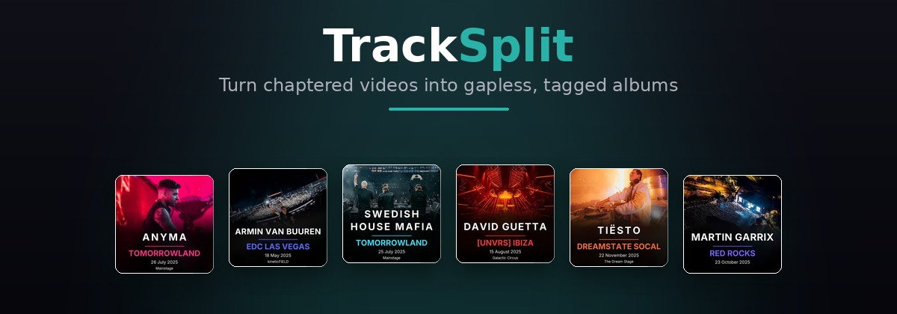

<p align="center">
  
  
  
</p>

<p align="center"><em>Chapter-based audio extractor for music servers. Turn your chaptered video library into gapless, tagged FLAC or Opus albums ready for Jellyfin and Lyrion.</em></p>

## What is TrackSplit?

TrackSplit is a Python CLI that reads chapter markers from video files (MKV, MP4, WebM, and more), splits the audio into individual tracks at sample-accurate boundaries, and writes a fully tagged music album with embedded cover art and an artist folder picture. FLAC sources stay lossless; Opus and other lossy sources are stream-copied when possible. Re-runs are skipped automatically unless the chapters actually changed.

It pairs naturally with [CrateDigger](https://github.com/Rouzax/CrateDigger), which embeds the chapter markers and metadata in the first place, but works on any chaptered video.

## Cover Gallery

**Album covers** generated for each set (embedded in every track and saved as `cover.jpg` / `folder.jpg`):

<table>
  <tr>
    <td></td>
    <td></td>
    <td></td>
    <td></td>
    <td></td>
  </tr>
</table>

**Artist folder images** (`artist.jpg`) composed from DJ artwork and name:

<table>
  <tr>
    <td></td>
    <td></td>
    <td></td>
    <td></td>
    <td></td>
  </tr>
</table>

## Features

- **Chapter-accurate splitting.** Sample-accurate cuts at chapter boundaries, gapless playback across tracks.
- **Codec-aware output.** FLAC for lossless sources, Opus stream-copy when safe, transparent re-encode when not. Pick with `--format`.
- **Rich metadata.** Writes TITLE, ARTIST, ARTISTS, ALBUMARTIST, ALBUMARTISTS, ALBUM, TRACKNUMBER, TRACKTOTAL, DISCNUMBER, DATE, GENRE, PUBLISHER, COMMENT, MUSICBRAINZ_ARTISTID, MUSICBRAINZ_ALBUMARTISTID, FESTIVAL, STAGE, VENUE as Vorbis comments.
- **Multi-artist aware.** Writes Picard-standard `ARTISTS` and aligned per-artist `MUSICBRAINZ_ARTISTID` so Lyrion and Jellyfin link every collaborator and remixer, not just the headliner.
- **Album and artist artwork.** Generates 1:1 cover art (embedded in every track and written to `cover.jpg` / `folder.jpg`) and an artist folder image.
- **Two metadata tiers.** Basic tagging for any chaptered video. Full enrichment when CrateDigger-style tags are present.
- **Re-run detection.** A manifest in each album folder tracks chapter hashes and source mtime, so repeat runs on the same library are near-instant.
- **Parallel batch mode.** Process a directory of videos with multiple workers and a live progress display.

## Quick Start

### Prerequisites

- [Python 3.11+](https://www.python.org/downloads/)
- [FFmpeg](https://ffmpeg.org/download.html) (ships `ffmpeg` and `ffprobe`)
- [MKVToolNix](https://mkvtoolnix.download/downloads.html) (optional, enables cover extraction from MKV attachments)

### Install

```bash
pip install -e .
tracksplit --check
```

`tracksplit --check` probes `ffmpeg`, `ffprobe`, and `mkvextract` and prints their versions (or an install hint if something is missing).

### Usage

```bash
# Single video
tracksplit video.mkv

# Directory of videos
tracksplit /path/to/videos/

# Specify output directory
tracksplit video.mkv --output /path/to/music/library/

# Force regeneration
tracksplit video.mkv --force

# Choose output format (auto, flac, or opus)
tracksplit video.mkv --format opus

# Dry run
tracksplit video.mkv --dry-run --verbose
```

## Configuration

TrackSplit works out of the box if `ffmpeg`, `ffprobe`, and (optionally) `mkvextract` are on your `PATH`. If they are installed elsewhere, point TrackSplit at them via a TOML config. Copy [`tracksplit.toml.example`](tracksplit.toml.example) and uncomment the keys you need.

Search order (first hit wins):

1. `./tracksplit.toml`
2. `./config.toml`
3. `~/.config/tracksplit/config.toml` (Linux/macOS) or `%APPDATA%/tracksplit/config.toml` (Windows)
4. `~/tracksplit.toml`, `~/.tracksplit.toml`

```toml
[tools]
ffmpeg     = "/usr/local/bin/ffmpeg"
ffprobe    = "/usr/local/bin/ffprobe"
mkvextract = "/usr/bin/mkvextract"
```

See [`docs/troubleshooting.md`](docs/troubleshooting.md) if something goes wrong on first run.

## Output Structure

```
Artist/
  folder.jpg
  artist.jpg
  Festival Year (Stage)/
    00 - Intro.flac (or .opus)
    01 - Track Title.flac
    02 - Track Title.flac
    cover.jpg
    .tracksplit_chapters.json
```

(Tier 2, CrateDigger-tagged source.) Tier 1 sources without festival metadata get `Artist/<filename-stem>/` instead.

`.tracksplit_chapters.json` is a manifest TrackSplit uses to detect whether a source file has changed since the last run. Safe to delete if you want to force one album to rebuild; safe to ignore in version control.

## Related projects

**[CrateDigger](https://github.com/Rouzax/CrateDigger)** is the sibling CLI that matches festival sets and concert recordings against 1001Tracklists, embeds chapter markers and metadata into MKV files, generates artwork and posters, and syncs your video library into Kodi. TrackSplit consumes the chapters and metadata CrateDigger writes, so the two tools share canonical artist names, festival spellings, and MusicBrainz IDs across your video and music libraries.

## Development

```bash
pip install -e ".[dev]"
pytest tests/ -v
```

Run integration tests with a real video file:

```bash
TRACKSPLIT_TEST_VIDEO=/path/to/video.mkv pytest tests/test_integration.py -v
```

## Disclaimer

Artwork displayed in this project is generated from DJ source images and chapter metadata that originates with CrateDigger and public festival/event material. All artwork, logos, and trademarks belong to their respective owners. TrackSplit is not affiliated with any festival, artist, or platform shown.

## License

This project is licensed under the GPL-3.0 License. See [LICENSE](LICENSE) for details.
